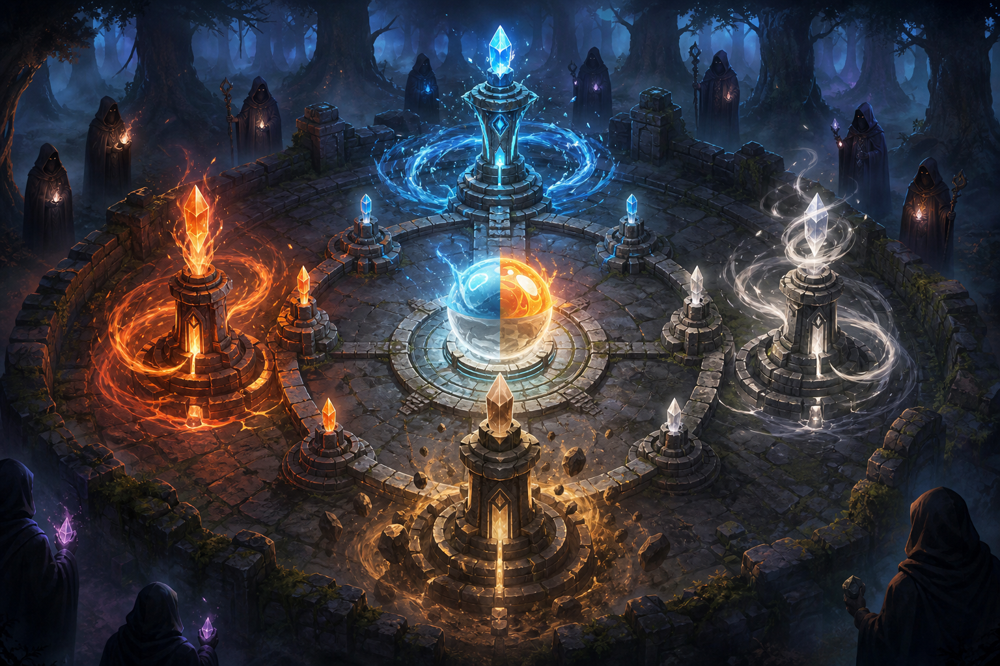
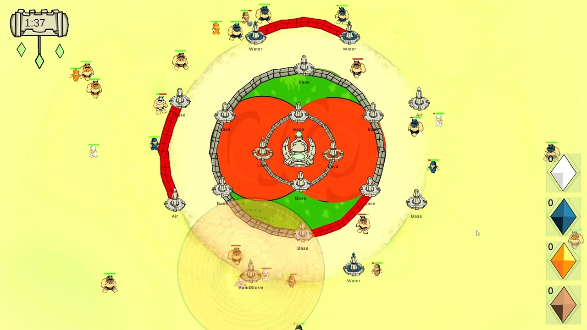
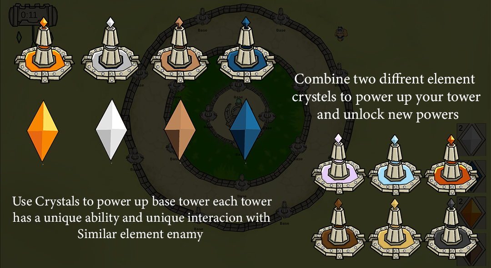

<p align="center">
  
</p>

<p align="center">
  <sub>Generated promotional artwork inspired by Tattva Shila's elemental world. Authentic gameplay screenshots appear below.</sub>
</p>

<h1 align="center">Tattva Shila</h1>

<p align="center">
  A 2D elemental tower-defence game about upgrading a ring of towers to protect an ancient portal from escalating waves of dark mages.
</p>

<p align="center">
  
  
  
  
</p>

<p align="center">
  <a href="https://dev0910.itch.io/tattva-shila"><strong>Play in Browser</strong></a>
  &nbsp;&middot;&nbsp;
  <a href="https://devp2349.wixsite.com/dev-patel-portfoli/copy-of-xylaris-journey-to-reunite"><strong>Portfolio Showcase</strong></a>
</p>

## Overview

Tattva Shila is a four-day collaborative game-jam project built in Unity, with Dev Patel serving as Lead Game Developer. Players defend a portal to the elemental realm by applying limited crystals to pre-positioned base towers, turning them into fire, water, earth, or air defences and combining different elements to unlock stronger tower types.

Enemy waves grow more demanding over time, while elemental strengths and resistances reward adapting the defence around the arena. A run ends when a dark mage reaches the portal, and the survival timer is saved as the player's high score. The released build is playable on the web and available for Windows through [itch.io](https://dev0910.itch.io/tattva-shila).

## Preview

<table>
  <tr>
    <td width="50%"></td>
    <td width="50%"></td>
  </tr>
  <tr>
    <td align="center"><sub>Elemental towers defending the portal during an enemy wave</sub></td>
    <td align="center"><sub>Single-element upgrades and two-element tower combinations</sub></td>
  </tr>
</table>

## Highlights

- Upgrade base towers into four elemental paths: fire, water, earth, and air.
- Combine two different elements to unlock Steam, Smoke, Sandstorm, Ice, Mud, or Lava towers.
- Exploit elemental damage multipliers and tower behaviours including burn, slow, knockback, and area damage.
- Manage limited resources as a random elemental crystal is awarded every 30 seconds.
- Survive progressively stronger waves and preserve the longest run as a local high score.
- Follow a complete menu, tutorial, gameplay, and end-screen flow.

## How to Play

1. Start from the main menu and continue through the tutorial into the arena.
2. Watch the elemental types approaching the portal and identify the towers that need upgrading.
3. Select an available crystal, then apply it to a base tower to create a fire, water, earth, or air tower.
4. Apply a different second crystal to unlock a combined tower with a new attack pattern.
5. Adapt the tower mix as waves intensify and survive for as long as possible.

## Controls

| Input | Action |
| --- | --- |
| `W`, `A`, `S`, `D` | Move the camera around the arena |
| Mouse wheel | Zoom in or out around the cursor |
| Left mouse button | Select an elemental crystal and apply it to a tower |
| Right mouse button | Deselect the currently held crystal |

## Elemental Combinations

A tower accepts one base element and, when compatible, one different second element. Combination order does not matter.

| Elements | Combined tower |
| --- | --- |
| Fire + Water | Steam |
| Fire + Air | Smoke / Flamethrower |
| Earth + Air | Sandstorm |
| Water + Air | Ice |
| Water + Earth | Mud |
| Fire + Earth | Lava |

## Getting Started

### Requirements

- [Git](https://git-scm.com/)
- [Unity Hub](https://unity.com/download)
- Unity Editor `2022.3.40f1`

### Run the Project

```bash
git clone https://github.com/Dev0910/Tattva-Shila.git
cd Tattva-Shila
```

1. In Unity Hub, choose **Add project from disk** and select the cloned repository.
2. Open the project with Unity `2022.3.40f1` and allow the package manifest to resolve.
3. Open `Assets/Scenes/MainMenu.unity`.
4. Enter Play Mode.

### Scene Flow

The enabled build scenes are already ordered as follows:

1. `Assets/Scenes/MainMenu.unity`
2. `Assets/Scenes/Tutorial.unity`
3. `Assets/Scenes/Game.unity`
4. `Assets/Scenes/EndScreen.unity`

To produce a standalone build, open Unity's build settings, select WebGL or Windows, confirm this scene order, and build to a directory outside the repository.

## Tech Stack

- Unity `2022.3.40f1` and C#
- Universal Render Pipeline `17.0.3` with Unity's 2D feature set
- Unity Input System `1.11.1`
- TextMesh Pro `3.0.9` and Unity UI
- DOTween for menu and interface transitions
- ScriptableObjects for tower and projectile configuration
- Custom object pooling for projectiles

## Project Structure

```text
Tattva-Shila/
|-- Assets/
|   |-- Data/               # Tower and projectile ScriptableObjects
|   |-- Prefabs/            # Towers, enemies, projectiles, and effects
|   |-- Scenes/             # Main menu, tutorial, game, and end screen
|   |-- Scripts/
|   |   |-- Enemy/          # Enemy movement, health, and resistances
|   |   |-- Managers/       # Waves, resources, timer, camera, and upgrades
|   |   `-- Tower/          # Targeting, attacks, projectiles, and effects
|   `-- Sprites/            # Game art, story panels, and interface assets
|-- Packages/               # Unity package manifest and lockfile
`-- ProjectSettings/        # Editor, rendering, input, and build settings
```

## Team

- **Lead Game Developer:** Dev Patel
- **Game Programmers:** Dev Patel, Hardik
- **Game Designers:** Ajay Singh, Dev Patel
- **Game Artists:** Ajay Singh, Ritesh, Tushar

## License and Third-Party Assets

This repository does not currently include a top-level project license. The repository itself therefore grants no permission to reuse or redistribute its original source or assets.

Third-party packages, fonts, plugins, music, and other imported assets remain subject to their respective licenses and terms. Review the notices bundled with those assets and their upstream licensing before redistribution.
